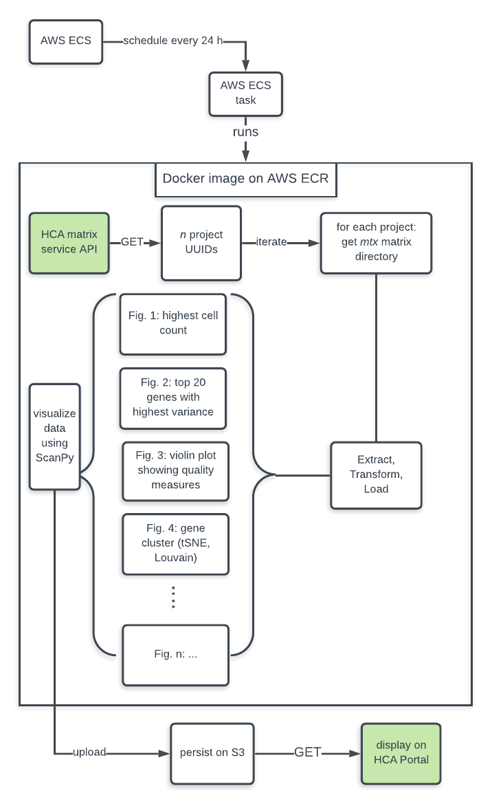
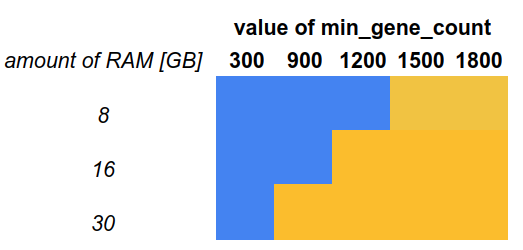

# data-portal-summary-stats

The service generates per-project summary figures. The service updates daily by running 
a Docker container on AWS Fargate. Figures are persisted on AWS S3. The general
architecture is as follows:



## Set-up
The code is written for Python version 3.6. Clone the repository to your local system and 
navigate into the `data-portal-summary-stats` directory. Create a virtual environment
and run `pip install -r requirements.txt` to install dependencies. You also need 
[Docker](https://www.docker.com) (here
we used version 18, Community Edition). Docker commands need to be run in sudo mode for 
security reasons. You can avoid this by adding the user to the `docker` group 
(see [here](https://linoxide.com/linux-how-to/use-docker-without-sudo-ubuntu/)). 

#### Install AWS
The service runs on AWS. Install the [AWS CLI](https://docs.aws.amazon.com/cli/latest/userguide/install-linux.html)
 and have your credentials and configuration files in `~/.aws`. Authentication and access is 
 role-based. Prior to executing commands  in a new shell using the AWS CLI set 
 `export AWS_DEFAULT_PROFILE=my-profile`, where `my-profile` is the role profile. 

#### Installation and configuration of Terraform
This app uses the infrastructure management software [Terraform](https://learn.hashicorp.com/terraform/getting-started/install.html).
 Download the executable (version 0.12 
or higher) into a directory that is part of the system's Linux `$PATH` so you can execute it 
anywhere. In the directory `infra` run `terraform init` to create the Terraform backend. 
Next, create a file `variables.tf` which contains all required variables. The following table 
contains a list of required variable names and their recommended values 
(all values are of type _String_).
 
| Variable | Description | Value |
| --- | --- | --- |
| `deployment_stage` | Deployment stage | "dev", "integration", "staging", or "prod" |
| `app_name` | Name of the service | "data-portal-summary-stats" |
| `image_name` | Name of the Docker image | "data-portal-summary-stats" |
| `image_tag` | Version of the image | e.g., "0.8.8" |
| `dpss_task_memory` | RAM allocated to the container instance [GB] | "16384" |
| `dpss_task_cpu` | Number of CPU units (1024 is equivalent to 1 core)| "2048" |

## Running the service

Once all required software is install, the basic steps to start the service are
1. Build the Docker image
2. Push the image to the AWS registry
3. Deploy the service using the Terraform

In the following we give detailed instructions for each individual step.

### 1. Build the Docker image
To build the Docker image `data-portal-summary-stats` create a new directory (e.g., `build`), 
then copy only the relevant files from the project root into `build`,
such that the tree of `build` looks like so:
```bash
.
├── data_portal_summary_stats.py
├── Dockerfile
├── requirements.txt
└── src
    ├── matrix_summary_stats.py
    ├── runner.py
    ├── settings.py
    └── utils.py

1 directory, 7 files
```

 Next navigate to the `build` directory, prepared as explained in the previous paragraph, and
 execute:
```bash
docker build --tag=data-portal-summary-stats:<tag #> .
```
where `tag #` denotes a version number of the build (e.g., `0.1`).

#### Input arguments to the container

Once the image is built on your local system run 
`docker run data-portal-summary-stats:<tag #> -h` to 
return the help message with a brief description of the arguments. Here they are
listed explicitly (default values are in bold):

| Argument | Values | Description |
| --- | --- | --- |
| `--environ` | **dev**, integration, staging, prod | Deployment environment from which matrix data are requested to create summary statistics. |
| `--source` | **fresh**, canned | Source of matrix files. "fresh" denotes requesting matrix files from the matrix service. "canned" denotes downloading already created matrix files from AWS S3. |
| `--blacklist` | **false**, true | If true, skip files with project IDs listed in a file named "blacklist" during processing (see below).
| `--min_gene_count` | integer between 300 and 2000| This value is part of the included filter when requesting a matrix file, and denotes the minimum count of detected genes for an element of the matrix to be included. |

For more information on the last argument `--min_gene_count` [go the Matrix Service Swagger UI](https://matrix.staging.data.humancellatlas.org/)
and exercise the endpoint `/v1/filters/{filter_name}` with `genes_detected` as `filter_name`.   

#### Running the `data-portal-summary-stats` Docker container locally

This describes how to run the images as a container on your local system. The code in 
`data_portal_summary_stats` needs to access AWS resources, so you need to pass your AWS
 credentials to container run. Suppose your credentials are in the usual subdirectory `~/.aws` 
 in your home directory, and they contain a profile named `my-profile`. In that case mount that 
 subdirectory as a volume inside the container, and set the environment variable with the default 
 profile like so:
```bash
docker run -v /home/user1/.aws:/root/.aws -e AWS_DEFAULT_PROFILE=my-profile \
       data-portal-summary-stats:<tag #> \ 
       --environ dev --source fresh --blacklist true --min_gene_count 1200
```

### 2. Push the image to AWS ECR
Push the image you just created to [ECR](https://aws.amazon.com/ecr/), AWS's image registry. Before
pushing the image [create a repository](https://console.aws.amazon.com/ecr/repositories) for 
your images using the AWS console. Be sure to give that repository the same name as the image.
Authentication is needed to push any image from localhost to that registry. Open a terminal and run

```bash
aws ecr get-login --region us-east-1 --no-include-email
```
This prints the Docker log-in command, something like 
`docker login -u AWS -p password https://aws_account_id.dkr.ecr.us-east-1.amazonaws.com`, where 
`password` has several hundred characters. Copy this command and run it in the terminal. 

Now create and tag your image (suppose you named it `data-portal-summary-stats`)
```bash
docker tag data-portal-summary-stats:<tag> <your ARN>.dkr.ecr.us-east-1.amazonaws.com/data-portal-summary-stats:<tag>
```

Next push image to the repository to the created namespace.
```bash
docker push <your ARN>.dkr.ecr.us-east-1.amazonaws.com/data-portal-summary-stats:<tag>
```

### 3. Deploy the service
We use AWS's ECS container orchestration service to run the container. To deploy it we use 
Terraform. Navigate to `infra` from the project root, then run 
```bash
export AWS_PROFILE=your-profile
```
followed by `terraform plan`, followed by `terraform apply` to deploy the infrastructure. This sets
up a `Scheduled Task`

## Handling of large matrix files
Depending on some parameters the matrix files of some projects are too large to process for even the largest available ECS 
container instance (e.g., we found that a matrix file of > 2 GB cannot be processed). We offer
 two solutions to this problem. 
 
The **first** and preferred solution aims to
 process all matrices by choosing a combination of RAM and a setting a suitable 
 value for the input
 argument `--min_gene_count`. The following figure shows results of some tests we ran using
 a matrix of project _Census of Immune Cells_ on September 4, 2019, which was the project with 
 the largest matrix file in the HCA on that day. The blue area denotes processing failures, and the 
 orange area denotes processing successes:
  
  
  
Based on these results we chose a combination of 16 GB RAM and setting `min_gene_count` to 
a value of `1200` as the optimal combination. 
 
The **second** solution is to simply black-list the matrix files that are too large to
 process. _blacklisting_
 a matrix file excludes it from the processing and is a solution of last resort. To use 
 the blacklist feature, set the command input argument `--blacklist` to `true` and create a 
 file named `blacklist`. To specify a matrix file from processing add its project ID to 
 that file, following the style of one project ID per line, without any delimiters. Next
 upload the file `blacklist` to the root of the `project-assets` S3 bucket of the corresponding
 deployment environment. One way to upload the file is (assuming `blacklist` is in the 
 directory :
 ```bash
 ls blacklist   // should return `blacklist`
 export AWS_DEFAULT_PROFILE=my_profile
 aws s3 cp blacklist s3://<deployment-env>.project-assets.remaining.url/ 
```
where _deployment-env_ is the bucket name of the deployment environment.  